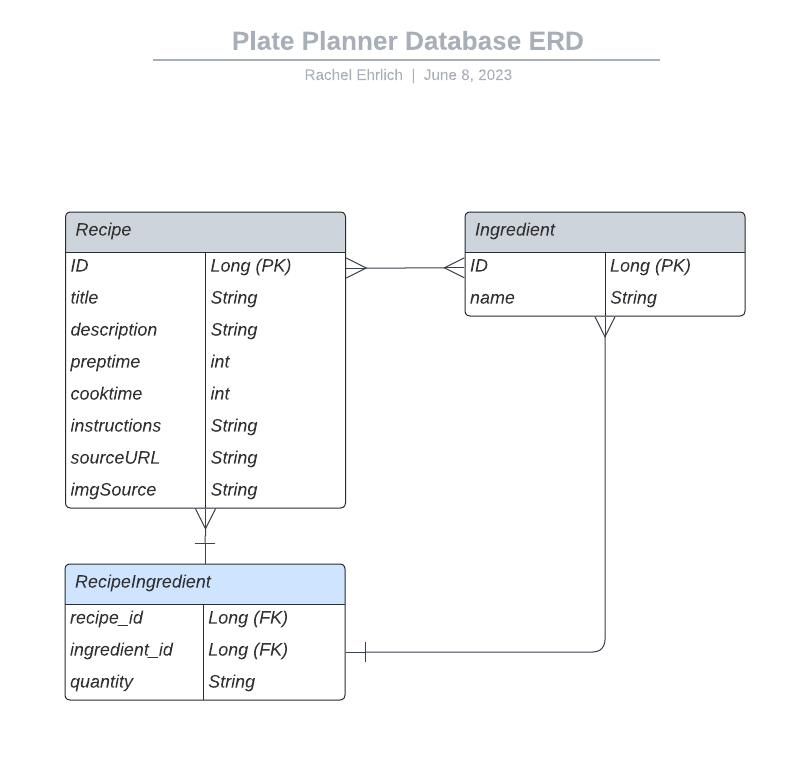

# Plate Planner API

## Table of Contents
* <a href="README.md#project-description"> Project Description</a>
* <a href="README.md#tools--technologies"> Tools & Technologies</a>
* <a href="README.md#project-planning-process"> Project Planning Process</a>
* <a href="README.md#hurdles"> Hurdles</a>
* <a href="README.md#installation-instructions-dependencies"> Installation Instructions/ Dependencies</a>
* <a href="README.md#credits"> Credits</a>

---
## Project Description
Plate Planner API aims to provide data on delicious recipes that are fun and mostly easy to prepare. The idea grew from my love for food and cooking and ultimately wanting to take the guesswork out of creating a grocery list. The aim is to use this as a basis/ plan for future consideration of a full application.

## Tools & Technologies
- 
- 
- 
- 
- 
- **Postman** - testing DB requests
- [Markdown Table Generator](https://www.tablesgenerator.com/markdown_tables)
- [ERD Tool](https://www.lucidchart.com/)
- [Wireframe Tool](https://www.figma.com/)

## Project Planning Process
Each day I would start by looking at my Kanban board, noting what I completed the day before, review what I have planned for the current day, and then prioritized breaking bigger tasks into smaller pieces.

I planned out the project using the following areas as main focus:

### User Stories
* As a User, I want to be able to see all recipes available.
* As a User, I want to select only certain recipes from a list, so that I can use them in my grocery planning
* As a User, I want to be able to have a grocery list that is based on my recipe selections.

#### Nice to have in the future:
* As a User, I want to be able to store my grocery lists in my account, so I can look at them again later
* As a User, I want to create a profile so that I can save recipes I enjoyed making.
* As a User, I want to be able to add my own recipes and save them to refere to later.

### ERD Diagram


### Endpoint Mappings

#### Recipe, Ingredient, and RecipeIngredient Controllers
| HTTP Methods 	| Full URL                                                            	|                       URL                      	|                Functionally                	|
|--------------	|---------------------------------------------------------------------	|:----------------------------------------------:	|:------------------------------------------:	|
| GET          	| http://localhost:8080/api/recipes                                   	| /recipes                                       	| Get all recipes                            	|
| GET          	| http://localhost:8080/recipes/{recipeId}                            	| /recipes/{recipeId}                            	| Get a recipe by id                         	|
| GET          	| http://localhost:8080/ingredients                                   	| /ingredients                                   	| Get all ingredients                        	|
| GET          	| http://localhost:8080/ingredients/{ingredientId}                    	| /ingredients/{ingredientId}                    	| Get an ingredient by id                    	|
| GET          	| http://localhost:8080/recipes/{recipeId}/ingredients                	| /recipes/{recipeId}/ingredients                	| Get all ingredients for a recipe by id     	|
| GET          	| http://localhost:8080/recipes/{recipeId}/ingredients/{ingredientId} 	| /recipes/{recipeId}/ingredients/{ingredientId} 	| Get an ingredient by id for a recipe by id 	|
| GET          	| http://localhost:8080/grocery-lists                                 	| /grocery-lists                                 	| Get grocerylist from recipes               	|

--------
### Kanban Project Plan


[Project Plan Link](https://github.com/users/rjehrlich/projects/5)

## Hurdles
* One big hurdle I had was when I first set up my entity relationships I was getting several server log errors about overriding hashcode() and equals() methods. This was mostly due to the fact that my relationships between entities is using composite keys as mappings.
  * I found [this article](https://thorben-janssen.com/ultimate-guide-to-implementing-equals-and-hashcode-with-hibernate/) on how to implement these methods which helped with my development process
* Due to my entity relationship setup I also had a REALLY tough time getting my endpoints to display the proper information I wanted. I ended up having to reconfigure them about 2 times

## Installation Instructions/ Dependencies

In order to use this codebase you will need to make sure you have the following dependencies in your pom.xml file:

```
<dependencies>
    <dependency>
        <groupId>org.springframework.boot</groupId>
        <artifactId>spring-boot-starter</artifactId>
    </dependency>

    <dependency>
        <groupId>org.springframework.boot</groupId>
        <artifactId>spring-boot-starter-test</artifactId>
        <scope>test</scope>
    </dependency>
    <dependency>
        <groupId>org.springframework.boot</groupId>
        <artifactId>spring-boot-starter-data-rest</artifactId>
    </dependency>
    <dependency>
        <groupId>org.springframework.boot</groupId>
        <artifactId>spring-boot-devtools</artifactId>
        <scope>runtime</scope>
        <optional>true</optional>
    </dependency>
    <dependency>
        <groupId>com.h2database</groupId>
        <artifactId>h2</artifactId>
        <scope>runtime</scope>
    </dependency>
    <dependency>
        <groupId>org.springframework.boot</groupId>
        <artifactId>spring-boot-starter-jdbc</artifactId>
    </dependency>
    <dependency>
        <groupId>org.springframework.boot</groupId>
        <artifactId>spring-boot-starter-data-jpa</artifactId>
    </dependency>
    <dependency>
        <groupId>junit</groupId>
        <artifactId>junit</artifactId>
        <scope>test</scope>
    </dependency>
    <dependency>
        <groupId>io.cucumber</groupId>
        <artifactId>cucumber-java</artifactId>
        <version>${cucumber.version}</version>
        <scope>test</scope>
    </dependency>
    <dependency>
        <groupId>io.cucumber</groupId>
        <artifactId>cucumber-junit</artifactId>
        <version>${cucumber.version}</version>
        <scope>test</scope>
    </dependency>
    <dependency>
        <groupId>io.cucumber</groupId>
        <artifactId>cucumber-spring</artifactId>
        <version>${cucumber.version}</version>
        <scope>test</scope>
    </dependency>
    <dependency>
        <groupId>io.rest-assured</groupId>
        <artifactId>rest-assured</artifactId>
        <version>4.3.0</version>
        <scope>test</scope>
    </dependency>
    <dependency>
        <groupId>org.springframework.boot</groupId>
        <artifactId>spring-boot-starter-web</artifactId>
        <version>3.0.5</version>
    </dependency>
</dependencies>
```
In order to successfully replicate/ run Cucumber Tests you will need to add this property to your pom.xml property tag:

``<cucumber.version>6.8.1</cucumber.version>``

## Credits
* Referred back to Java Spring Boot Lesson for explanations: https://git.generalassemb.ly/sureshmelvinsigera/Java-Spring-Boot-lecture/tree/spring-2-7-8
* [JAVA API](https://docs.oracle.com/en/java/javase/17/docs/api/index.html)
* [Spring Framework Documentation](https://docs.spring.io/spring-framework/docs/current/reference/html/)
* **Leo R (GA Instructor)**: https://github.com/LRodriguez92
    * For spending what seemed like hours with me on installation issues in Angular and advice on project logic.
* **Suresh S (GA Instructor)**: https://github.com/sureshmelvinsigera/
    * For also helping throughout our learning journey and being patient debugging issues with us!
* **Dhrubo C (GA Instructor)**: https://git.generalassemb.ly/dhrubo57
  * For helping through some hard Cucumber Test case logic